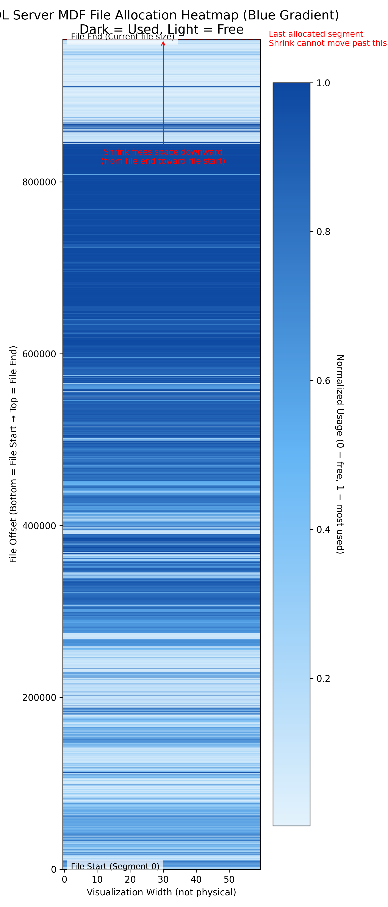

# SQL MDF File Allocation Visualizer
A simple SQL + Python tool to visualize how SQL Server allocates pages inside
an MDF file — and to understand why `DBCC SHRINKFILE` is sometimes instant,
sometimes slow, and sometimes does nothing.

This tool helps you **see** the physical layout of the MDF file, so shrink
behavior becomes predictable instead of a black box.

---

## 🔍 What This Tool Shows
SQL Server does not shrink based on free space.  
It shrinks based on the **highest allocated extent** in the file.

This visualization reveals:

- Dense data zones  
- Mostly free zones  
- Tiny “tail allocations” that block shrink  
- The exact physical point where shrink must stop  
- Why shrink generates large log activity  

The output is a vertical heatmap:

- **Dark** = heavily used  
- **Light** = free/sparse  
- **Bottom** = physical end of MDF file  
- **Red line** = shrink boundary  

---

### Interpretation
- Top area → mixed allocations  
- Middle → dense active data  
- Lower → mostly free  
- Bottom few blocks → tiny allocations that **block shrink**  
- Red line → physical stop point where `DBCC SHRINKFILE` must halt  

This visualization makes shrink behavior predictable instead of a black box.  

## 📂 Repository Structure

